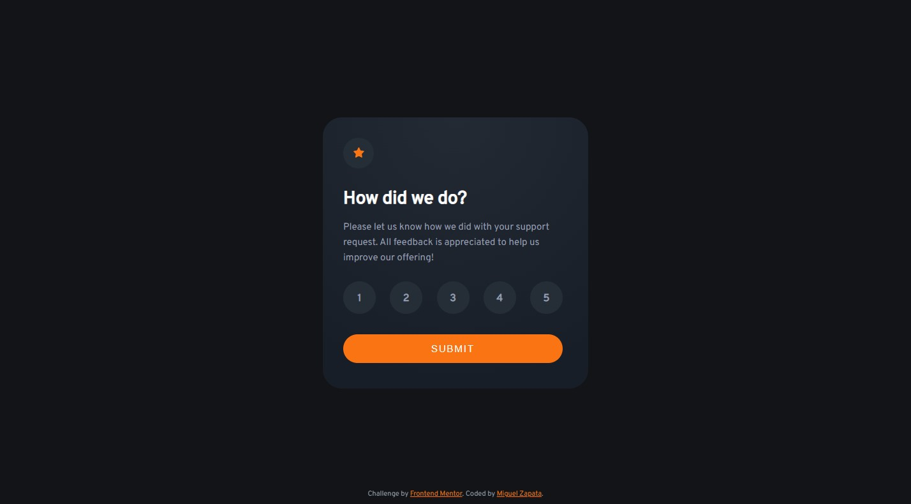

# Frontend Mentor - Interactive rating component solution

This is a solution to the [Interactive rating component challenge on Frontend Mentor](https://www.frontendmentor.io/challenges/interactive-rating-component-koxpeBUmI). Frontend Mentor challenges help you improve your coding skills by building realistic projects. 

## Table of contents

- [Overview](#overview)
  - [The challenge](#the-challenge)
  - [Screenshot](#screenshot)
  - [Links](#links)
- [My process](#my-process)
  - [Built with](#built-with)
  - [What I learned](#what-i-learned)
  - [Continued development](#continued-development)
  - [Useful resources](#useful-resources)
- [Author](#author)

## Overview

### The challenge

Users should be able to:

- View the optimal layout for the app depending on their device's screen size
- See hover states for all interactive elements on the page
- Select and submit a number rating
- See the "Thank you" card state after submitting a rating

### Screenshot



Add a screenshot of your solution. The easiest way to do this is to use Firefox to view your project, right-click the page and select "Take a Screenshot". You can choose either a full-height screenshot or a cropped one based on how long the page is. If it's very long, it might be best to crop it.

Alternatively, you can use a tool like [FireShot](https://getfireshot.com/) to take the screenshot. FireShot has a free option, so you don't need to purchase it. 

Then crop/optimize/edit your image however you like, add it to your project, and update the file path in the image above.

### Links

- Solution URL: [https://www.frontendmentor.io/solutions/interactive-rating-component-using-css-flexbox-HydnSvm4c](https://www.frontendmentor.io/solutions/interactive-rating-component-using-css-flexbox-HydnSvm4c)
- Live Site URL: [https://miguelzaga.github.io/interactive-rating-component/](https://miguelzaga.github.io/interactive-rating-component/)

## My process

### Built with

- Semantic HTML5 markup
- CSS custom properties
- Flexbox
- Mobile-first workflow

### What I learned

#### CSS
This is the code that I adapted to create the Toggle Tokens, I really like it.
And I am grateful to find the example from Florian Strasser [link](https://codepen.io/flostrasser/details/QWNBvjo)
```css
.rating-input + .rating-label {
  padding: 13px;
  width: 42px;
  height: 42px;
  border-radius: 42px;
}

.rating-input:hover + .rating-label {
  background-color: var(--orange);
  color: var(--white);
}

.rating-input:checked + .rating-label {
  background-color: var(--mediumGrey);
  color: var(--white);
}

```
#### JavaScript

In the script, I wrote this loop to check what radio button was checked, I don't think that is very efficient to do it this way, but it works and I was able to do it.
```js
  let getRadioValue = function () {
    let inputs = form.elements["rating"];
    for (let i = 0; i < inputs.length; i++) {
      let input = inputs[i];
      if (input.checked) {
        return input.id;
      }
    }
  };
```

### Continued development

I need to improve in button design and form capture.

### Useful resources

- [Toggle Token](https://codepen.io/flostrasser/details/QWNBvjo) - This is example code to make a Toggle Token. It is an amazing way to style radio buttons.
- [HTMLFormElement.elements](https://developer.mozilla.org/en-US/docs/Web/API/HTMLFormElement/elements) - It helped me to access the values of the form. Although, I am sure there must be a better way.

## Author

- Frontend Mentor - [@miguelzaga](https://www.frontendmentor.io/profile/miguelzaga)
- Linkedin - [Miguel Zapata](https://www.linkedin.com/in/miguelzaga/)